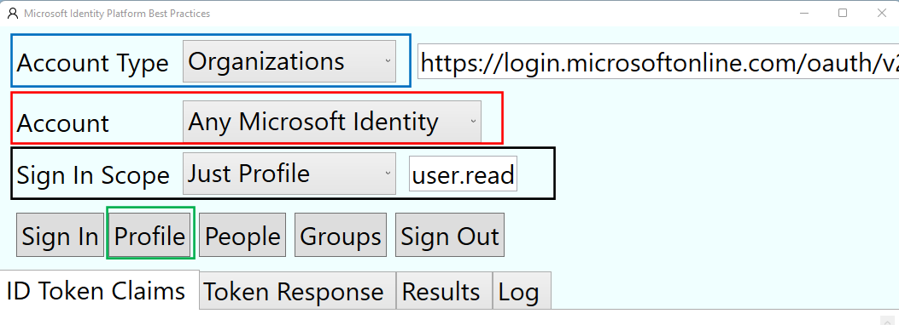
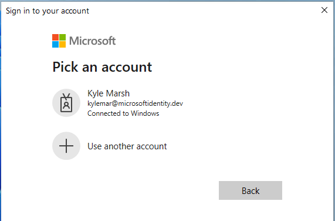
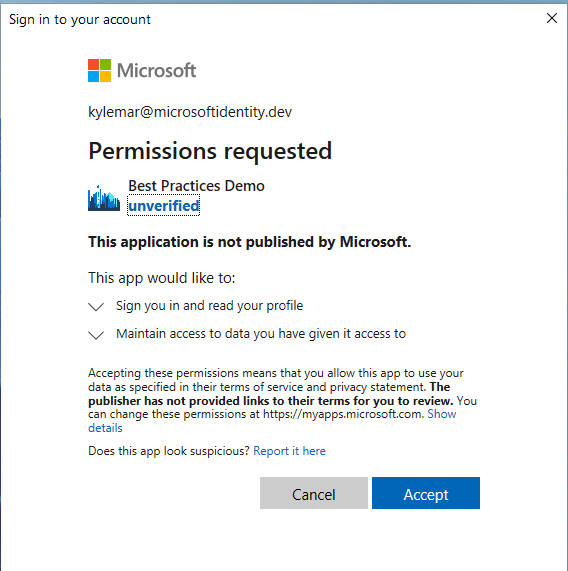
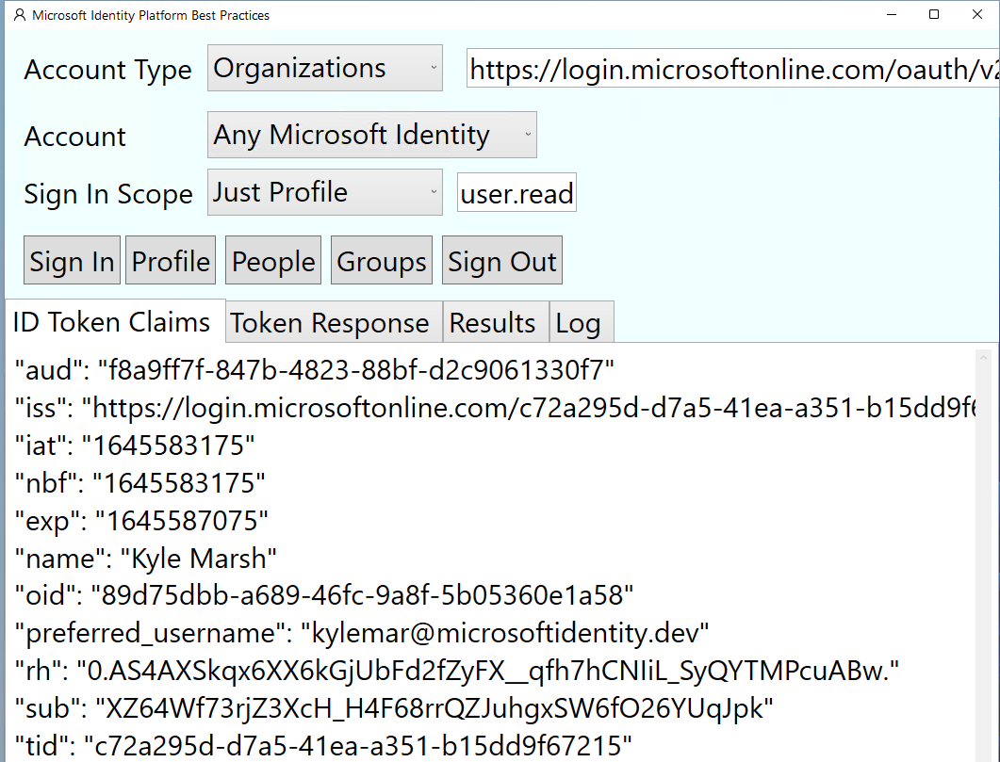
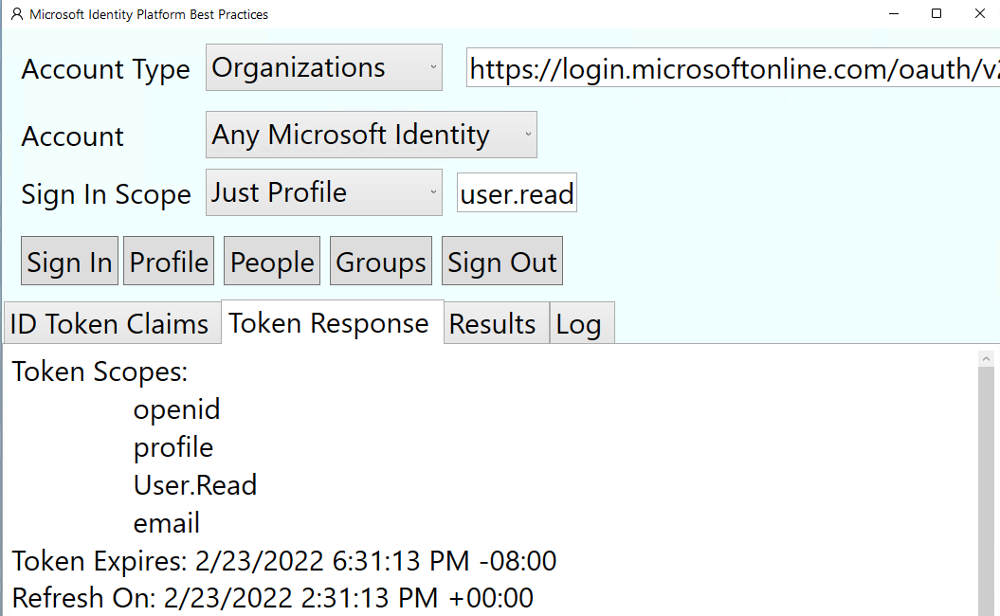
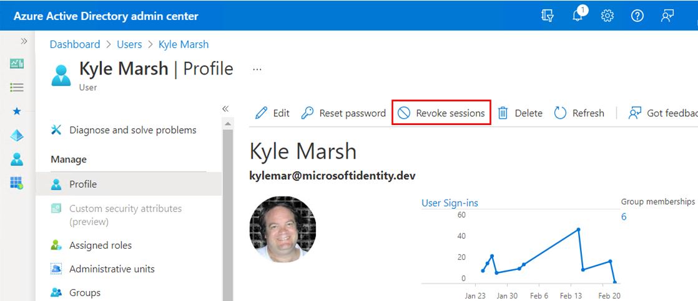

# Implemeting CAE on the client application with MSAL.NET library. 

## About this Demo

### Scope of this demo

In this demo, you will learn, how to implement Continous Access Evaluation (CAE) in a client application via the MSAL.NET library. This is a WPF application that is making calls to the Microsoft Graph API. 

### Details of the demo – How it works 

#### How to run this sample 

Pre-requisites
1.	Install Visual Studio - https://visualstudio.microsoft.com/downloads/  Select .NET Desktop Development
2.	A user account in your Azure AD tenant, or a Microsoft personal account

#### Step 1: Clone or download this repository

From your shell or command line:

```Shell
git clone https://github.com/kylemar/BestPracticesDemo.git
cd "BestPracticesDemo"

```

or download and extract the repository .zip file.

> Given that the name of the sample is quite long, and so are the names of the referenced NuGet packages, you might want to clone it in a folder close to the root of your hard drive, to avoid file size limitations on Windows.

#### Step 2: Open the project in Visual studio and run it. 

Once you download the sample, open the solution file in visual studio and after successful rebuild, debug/run the sample. The following window should appear. Select the highlighted(Different colors) options in the popup.

 
 
 
#### Step 3: Initiate authetication from the app.

Click on the Sign-in button which should bring the authentication page similar to the image below.

 
 

#### Step 4: Consent the app

Select the user who is signing into the app. If you are using the app for the first time, you will be asked to consent as below. Click on Accept button.

 
 
#### Step 5: Inspect the claims

Now on the main window click on the profile button and it should show the ID token claims as below

 
 
#### Step 6: Observe the token lifetime

Click on Token response button and observe the “Token expires” value. It will be valid for 23-28 hours. This is unlike for an app that does not support CAE where the access token is valid for 60-90 minutes. 

 

#### Step 7: Invalidate the user session 

Now visit Azure portal and select the user with against which you have signed into the app. Then revoke the user's sessions.   

 

 
 #### Step 8: Observe the CAE feature in action
 
 Wait for 10 minutes and click on the profile button again. Since CAE is enabled, it will ask the user to authenticate again. 
 
 ### Code – How it works
 
 From the code perspective, the application is calling the Microsoft Graph API. The following line informs Azure AD that the application supports CAE.  
 
   ```csharp
            builder.WithClientCapabilities(new[] { "cp1" });
  ```

The app can inform Azure AD that it supports CAE since it handles CAE Claim Challenges from the Microsoft Graph API. After revoking the session in the Azure portal, when you click on the profile button, the access token will no longer be sufficient to access the user's profile in Microsoft Graph. The below code is handling the scenario.

APIrequest.Headers.Authorization = new System.Net.Http.Headers.AuthenticationHeaderValue("Bearer", token);
                APIresponse = await httpClient.SendAsync(APIrequest);
        
        ```csharp
                if (APIresponse.IsSuccessStatusCode)
                {
                    var content = await APIresponse.Content.ReadAsStringAsync();
                    var expandedContent = content.Replace(",", "," + Environment.NewLine);
                    return expandedContent;
                }
                else
                {
                    if (APIresponse.StatusCode == System.Net.HttpStatusCode.Unauthorized
                        && APIresponse.Headers.WwwAuthenticate.Any())
                    {
                        AuthenticationHeaderValue bearer = APIresponse.Headers.WwwAuthenticate.First
                            (v => v.Scheme == "Bearer");
                        IEnumerable<string> parameters = bearer.Parameter.Split(',').Select(
                            v => v.Trim()).ToList();
                        var error = GetParameter(parameters, "error");

                        if (null != error && "insufficient_claims" == error)
                        {
                            var claimChallengeParameter = GetParameter(parameters, "claims");
                            if (null != claimChallengeParameter)
                            {
                                var claimChallengebase64Bytes = System.Convert.FromBase64String(
                                    claimChallengeParameter);
                                var ClaimChallenge = System.Text.Encoding.UTF8.GetString(
                                    claimChallengebase64Bytes);

                                var newAccessToken = await GetAccessToken(scopes, ClaimChallenge);
                                if (null != newAccessToken)
                                {
                                    var APIrequestAfterCAE = new HttpRequestMessage(
                                        System.Net.Http.HttpMethod.Get, url);
                                    APIrequestAfterCAE.Headers.Authorization = 
                                        new System.Net.Http.Headers.AuthenticationHeaderValue(
                                            "Bearer", newAccessToken);

                                    HttpResponseMessage APIresponseAfterCAE;
                                    APIresponseAfterCAE = await httpClient.SendAsync(
                                        APIrequestAfterCAE);

                                    if (APIresponseAfterCAE.IsSuccessStatusCode)
                                    {
                                        var content = await APIresponseAfterCAE.Content.ReadAsStringAsync();
                                        var expandedContent = content.Replace(",", "," + Environment.NewLine);
                                        return expandedContent;
                                    }
                                }
                            }
                        }
                        return APIresponse.StatusCode.ToString() + " " + "Authorization: " + bearer.ToString();
                    } 
  ```
  
